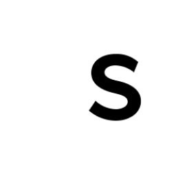

<p align="center">
  <a href="https://www.gatsbyjs.com/?utm_source=starter&utm_medium=readme&utm_campaign=minimal-starter-ts">
    
  </a>
</p>
<h1 align="center">
  Secret Kitchen Calendar
</h1>

1.  **Склонируйте репозиторий.**

    Откройте терминал в нужной вам папке и используйте команду ниже

    ```shell
    # должен быть установлен Git на вашем компьютере
    git clone https://github.com/DumbassIAm/Secret-Calendar.git
    ```

2.  **Откройте проект в удобной для вас IDE.**
3. **Откройте терминал в проекте и установите пакеты**

    ```shell
    # должен быть установлен Node на вашем компьютере
    npm install
    ```

3.  **Запустите проект**

    ```shell
    npm run develop
    ```

    Проект запустится тут -> http://localhost:8000!
